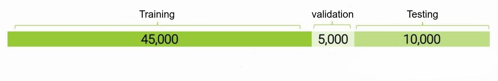
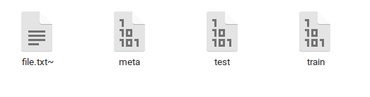

## ****Image Classification with CIFAR-100 dataset****

These notebooks is mid-term project for machine-learning-and-data-mining-I class.

This project was done by group … :

- BI11-090 Phạm Minh Hiếu
- BI11-257 Lê Đình Thông
- BI11-111 Hoàng Quang Huy
- BI11-004 Văn Quốc An
- BI11-134 Nguyễn Tùng Lâm

## Abstracts

CIFAR-100 is a computer vision data set used for object recognition. This dataset contains 60,000 32x32 pixel color images distributed in 100 classes of objects follow by 20 superclass , with 600 images per class, these are:

| Superclass                    |      Classes                                        |
| ----------                    |:-------------:                                      |
|aquatic mammals	              |beaver, dolphin, otter, seal, whale                  |
| fish                          |aquarium fish, flatfish, ray, shark, trout           |
| flowers                       |orchids, poppies, roses, sunflowers, tulips          |
|food containers	              |bottles, bowls, cans, cups, plates                   |
|fruit and vegetables           |apples, mushrooms, oranges, pears, sweet peppers     |
|household electrical devices   |clock, computer keyboard, lamp, telephone, television|
|household furniture	          |	bed, chair, couch, table, wardrobe                  |
|insects                        | 	bee, beetle, butterfly, caterpillar, cockroach    |
|large carnivores               |	bear, leopard, lion, tiger, wolf                    |
|large man-made outdoor things	|  	bridge, castle, house, road, skyscraper           |
|large natural outdoor scenes   | cloud, forest, mountain, plain, sea                 |
|large omnivores and herbivores |	camel, cattle, chimpanzee, elephant, kangaroo       |
|medium-sized mammals	          |  	fox, porcupine, possum, raccoon, skunk            |
|non-insect invertebrates       |   	crab, lobster, snail, spider, worm              |
|people                         | baby, boy, girl, man, woman                         |
|reptiles	                      | 	crocodile, dinosaur, lizard, snake, turtle        |
|small mammals                  |  	hamster, mouse, rabbit, shrew, squirrel           |
|trees                          | maple, oak, palm, pine, willow                      |
|vehicles 1	                    | 	bicycle, bus, motorcycle, pickup truck, train     |
|vehicles 2                     |  lawn-mower, rocket, streetcar, tank, tractor       |

Of this total of 60,000 images, 50,000 are for training and 10,000 for testing. For this specific project, 10% of training images were removed to validate, leaving the data distribution as follows:

The purpose of this project is to recognize an image and predict which of the 100 CIFAR-100 classes it belongs to by mainly using Logistic Regression with Neural Net

The following model are used in this project

- Logistic Regression
- CNN

## The Data Set

There are 500 training images and 100 testing images per class. The 100 classes in the CIFAR-100 are grouped into 20 superclasses. Each image comes with a "fine" label (the class to which it belongs) and a "coarse" label (the superclass to which it belongs).

The dimension of a color image is 32x32 pixels and is made up of 3 channels (Red, Green, Blue = RGB) for each pixel present in them. The values for each channel range from 0 to 255, allowing each pixel in the image to be colored. Considering the above, you have 32 x 32 x 3 = 3072 data per image.

## Results
